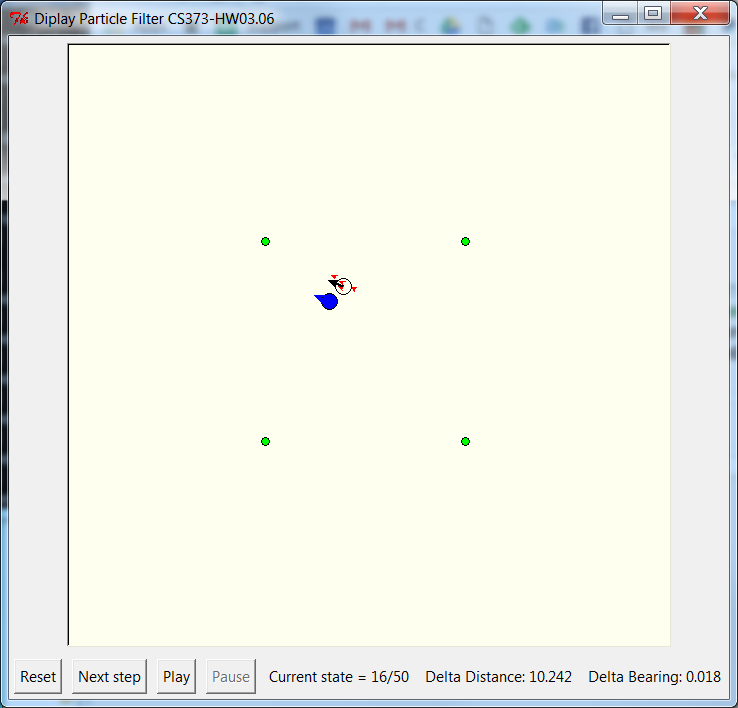

# cs373ParticleFilter
A GUI and test environment for Udacity CS373 Artificial Intelligence for Robotics section 3.6 Particle Filters with cleaned up code from marcellolarocca and berthy424
https://discussions.udacity.com/t/particle-fine-tuning-on-the-fly-genetic-algorithms/57680/23
Running Anaconda IPython 2.7 Notebook.

In this picture, the actual robots position is the blue circle and it's orientation is indicated with the little "nose". 
It has moved 16 times out of a 50 step trip.
The open circle is the "ghost" and shows the average of the particle postitions and orientations.
The ghost is a litte more than 10 units away from the actual position of the robot, and it's orientation is 0.018 rads off.
Each particle is a little red triangle. There are actually 20 in this, but most are concentrated in the same location.
The 4 green circles are the landmarks.

The code that generated this simulation is:
<PRE>from particleFilterGUI import  *
number_of_iterations = 50
N = 20            #Number of particles used
motions = [[3. * pi / 20, 12.] for row in range(number_of_iterations)]
wind = DispParticleFilter ( motions, N, displayRealRobot = True, displayGhost = True, 
                           enableElitism = False, enableMutation = False, enableMemetic = False )
wind.mainloop()
</PRE>
